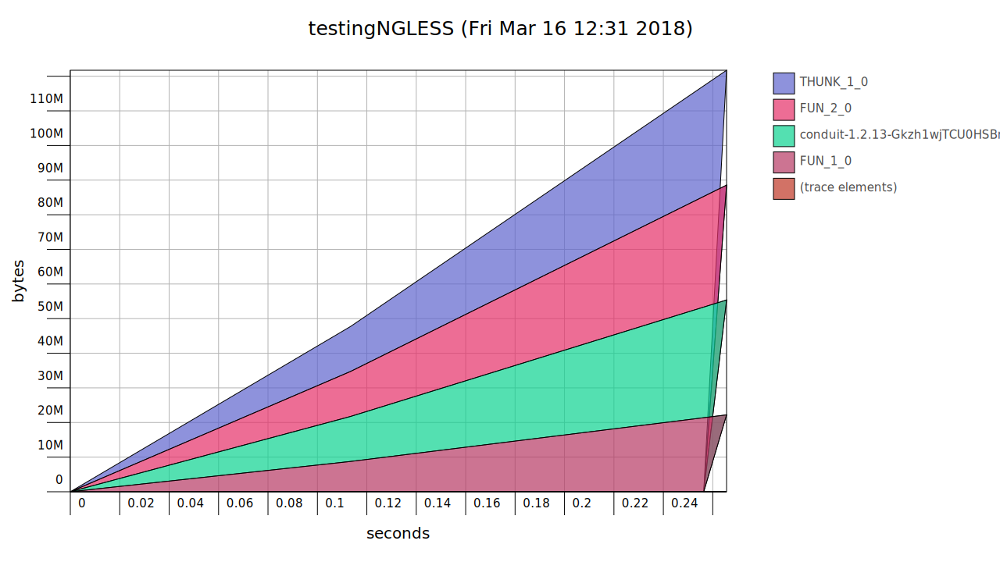
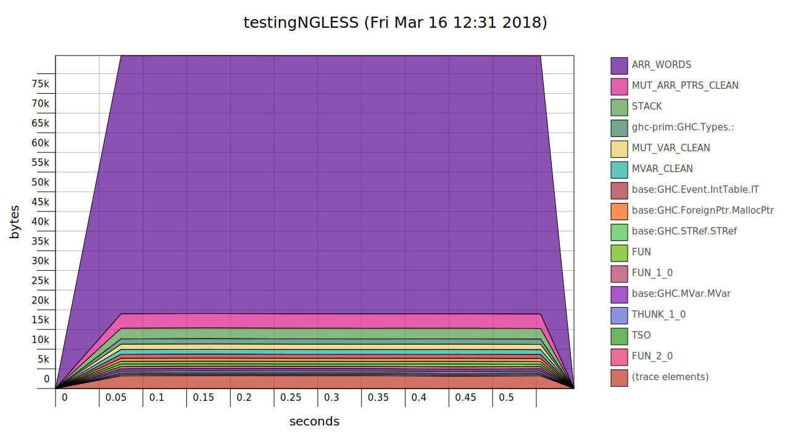

# Testing of -O2 pessimization with GHC

This code **uses linear space with -O2**, but runs in constant space without it.

This is a stripped down bit of [NGLess](http://ngless.embl.de) where this
strange behaviour was first observed.

`stack setup`

# Build with O2


Build with `-O2` and run


```bash
    stack build
    /usr/bin/time -v $(stack path --local-install-root)/bin/testingNGLESS
```

This is the result (increasing memory usage, upt to 150M in 3.5 seconds):



# Build without O2

```bash
    stack clean
    stack build --fast
    /usr/bin/time -v $(stack path --local-install-root)/bin/testingNGLESS
```
This is the result (roughly stable memory usage, maximum usage around 11MB)



# RESULTS

The files `testingNGLESS_O2.svg` and `testingNGLESS-FAST.svg` show the memory
profiles of running the above.

Note that this is a small input file. On real data, memory usage is much higher
(several GBs).

